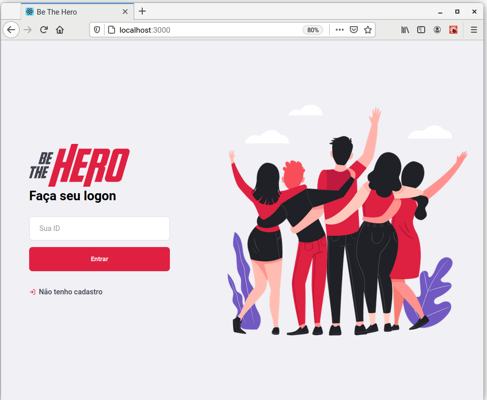

# OmniStack Week 11 - Be the Hero



## This is my code from OmniStack Week 11 by [Rocketseat](https://rocketseat.com.br)

This application is composed of a web frontend made using Reactjs, a backend made using Nodejs, and a Mobile client made using React-Native.

## Prerequisites

- Nodejs v12
- Docker
- docker-compose

## How to run

### Frontend

To run the frontend, go to folder /aulas/frontend and execute the following commands:

```sh
npm install
npm start
```

Access the frontend visiting <http://localhost:3000>.

### Backend

To run the backend, first we need to generate a development database. To generate a sqlite3 database, go to folder /aulas/backend and execute:

```sh
npm install
npx knex migrate:latest
```

And run the node backend with the following command:

```sh
npm start
```

We can also run the backend in development mode, using nodemon, running:

```sh
npm run dev
```

The backend will be exposed in <http://localhost:3333>.

### Mobile

The mobile client was made using Expo. To run the mobile client, execute the commands:

```sh
npm install
npm start
```

Follow the CLI instructions to run the Mobile client in a real Cellphone, Emulator ou Web.

### Containers

To run containers for frontend in development mode, frontend in production mode and the backend, execute the following command inside the folder /aulas:

```sh
docker-compose up
```

To stop and remove the containers, execute:

```sh
docker-compose down
```
